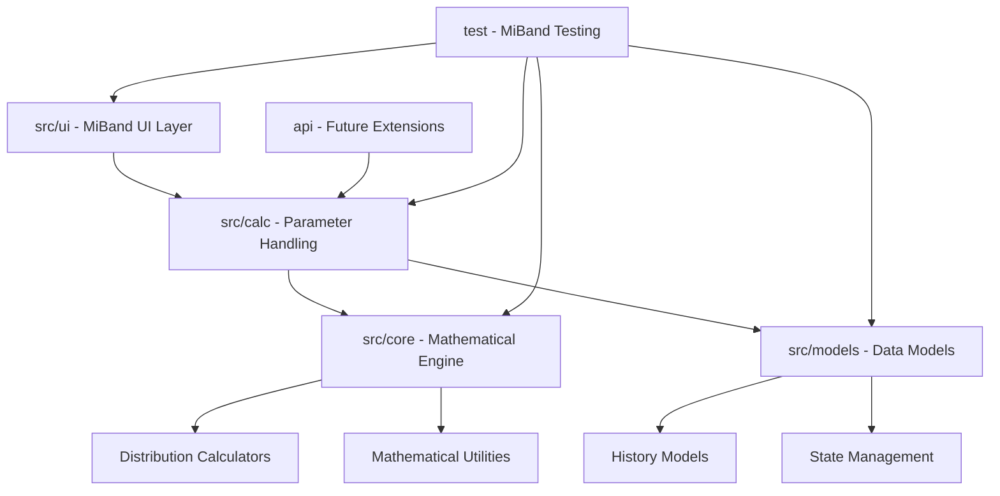

# Design Document

## Overview

The Statistics Probability and Distribution Calculator for Xiaomi Miband 10 is a native Vela OS application that provides comprehensive statistical calculation capabilities on a wearable device. The app leverages C/C++ for performance-critical mathematical computations while using JavaScript for UI logic, taking advantage of Vela OS's hybrid development model.

The application follows a modular architecture optimized for the resource-constrained environment of a wearable device, with efficient memory management and battery-conscious design patterns.

## Architecture

### Project Structure

```
miband-stats-calculator/
├── src/
│   ├── ui/                 # MiBand UI components and interface
│   │   ├── screens/        # Individual screen components
│   │   ├── components/     # Reusable UI components
│   │   └── gestures/       # Touch gesture handlers
│   ├── models/             # Data models and operator design
│   │   ├── distributions/  # Distribution data structures
│   │   ├── history/        # Calculation history models
│   │   └── state/          # Application state management
│   ├── calc/               # Input/output parameter handling
│   │   ├── validators/     # Parameter validation logic
│   │   ├── formatters/     # Result formatting utilities
│   │   └── engine/         # Core calculation engine
│   └── core/               # Mathematical engine and utilities
│       ├── distributions/  # Statistical distribution implementations
│       │   ├── lib/        # Header files (.h) - Distribution interfaces
│       │   └── code/       # Source files (.c) - Distribution implementations
│       ├── math/           # Mathematical utility functions
│       └── constants/      # Mathematical constants and lookup tables
├── api/                    # Future API handling and extensions
│   ├── interfaces/         # API interface definitions
│   └── handlers/           # Request/response handling
└── test/                   # MiBand testing and validation
    ├── unit/               # Unit tests for individual components
    ├── integration/        # Integration tests
    └── device/             # Device-specific testing
```

### High-Level Architecture



### Component Breakdown

1. **src/ui**: MiBand-specific UI components, screens, and gesture handling
2. **src/models**: Data structures, operators, and state management
3. **src/calc**: Input parameter validation and output formatting
4. **src/core**: Mathematical engine with statistical calculations
5. **api**: Future API extensions and external integrations
6. **test**: Comprehensive testing suite for MiBand device

## Components and Interfaces

### 1. src/ui - MiBand UI Components

#### src/ui/screens/
- **MainMenuScreen**: Distribution category selection (Continuous/Discrete)
- **DistributionScreen**: Individual distribution selection within categories  
- **ParameterInputScreen**: Dynamic input forms based on selected distribution
- **ResultsScreen**: PDF/CDF results display with proper formatting
- **HistoryScreen**: Calculation history management and display

#### src/ui/components/
- **TouchKeypad**: Numeric input component optimized for MiBand screen
- **ScrollList**: Scrollable list component with gesture support
- **ResultFormatter**: Display component for statistical results
- **ErrorDialog**: User-friendly error message display

#### src/ui/gestures/
- **SwipeHandler**: Left/right navigation between screens
- **TapHandler**: Touch input processing for buttons and fields
- **LongPressHandler**: Long press gesture for calculations

### 2. src/models - Data Models and Operators

#### src/models/distributions/
```c
typedef struct {
    uint8_t distribution_id;
    const char* name;
    uint8_t param_count;
    const char** param_names;
    double param_ranges[4][2];  // min/max for each parameter
} distribution_model_t;
```

#### src/models/history/
```c
typedef struct {
    uint32_t timestamp;
    uint8_t distribution_type;
    double parameters[4];
    double input_value;
    double pdf_result;
    double cdf_result;
} calculation_entry_t;
```

#### src/models/state/
```c
typedef struct {
    uint8_t current_distribution;
    uint8_t current_category;
    double current_parameters[4];
    uint8_t parameter_count;
    calculation_entry_t history[10];
    uint8_t history_count;
} app_state_t;
```

### 3. src/calc - Parameter Handling

#### src/calc/validators/
- **ParameterValidator**: Input validation for all distribution parameters
- **RangeChecker**: Parameter range validation and constraint checking
- **FormatValidator**: Numeric format validation and parsing

#### src/calc/formatters/
- **ResultFormatter**: PDF/CDF result formatting with precision control
- **ScientificNotation**: Small value formatting in scientific notation
- **DisplayOptimizer**: Screen-optimized result presentation

#### src/calc/engine/
- **CalculationOrchestrator**: Main calculation workflow coordination
- **ErrorHandler**: Calculation error processing and recovery
- **CacheManager**: Result caching for performance optimization

### 4. src/core - Mathematical Engine

#### src/core/distributions/
The distributions module is organized into two subdirectories for better code organization:

- **src/core/distributions/lib/**: Contains all header files (.h) defining distribution interfaces and data structures
- **src/core/distributions/code/**: Contains all source files (.c) with distribution implementations

```c
typedef struct {
    double (*pdf)(double x, double* params, int param_count);
    double (*cdf)(double x, double* params, int param_count);
    int (*validate_params)(double* params, int param_count);
    const char* distribution_name;
    int param_count;
    const char** param_names;
} distribution_t;
```

**Distribution Organization:**
- Header files in `lib/` define interfaces for: binomial, chi-square, exponential, F, geometric, hypergeometric, negative binomial, normal, Poisson, and t-distributions
- Source files in `code/` contain the corresponding mathematical implementations
- The `distribution_interface.h` in `lib/` provides the common interface structure

#### src/core/math/
- **GammaFunction**: Gamma function approximation for statistical distributions
- **BetaFunction**: Beta function implementation
- **Combinatorics**: Factorial and combination calculations
- **ErrorFunction**: Error function for Normal distribution

#### src/core/constants/
- **MathConstants**: Pre-computed mathematical constants
- **LookupTables**: Optimization tables for common calculations

### 5. api - Future API Extensions

#### api/interfaces/
- **ExternalAPI**: Interface definitions for future cloud integration
- **DataSync**: Synchronization interfaces for cross-device data
- **UpdateManager**: App update and distribution management

#### api/handlers/
- **RequestProcessor**: API request handling and routing
- **ResponseFormatter**: API response formatting and validation
- **AuthManager**: Authentication and security handling

### 6. test - MiBand Testing

#### test/unit/
- **MathTests**: Unit tests for mathematical functions and distributions
- **UITests**: Component-level UI testing
- **ModelTests**: Data model validation and testing

#### test/integration/
- **WorkflowTests**: End-to-end calculation workflow testing
- **UIIntegrationTests**: Complete UI interaction testing
- **PerformanceTests**: Memory and CPU usage validation

#### test/device/
- **HardwareTests**: MiBand 10 specific hardware testing
- **BatteryTests**: Power consumption validation
- **DisplayTests**: Screen optimization and readability testing

### 3. Data Models

#### Calculation History Entry
```c
typedef struct {
    uint32_t timestamp;
    uint8_t distribution_type;
    double parameters[4];  // Max 4 parameters for any distribution
    double input_value;
    double pdf_result;
    double cdf_result;
} calculation_entry_t;
```

#### Application State
```c
typedef struct {
    uint8_t current_distribution;
    uint8_t current_category;  // 0=continuous, 1=discrete
    double current_parameters[4];
    uint8_t parameter_count;
    calculation_entry_t history[10];
    uint8_t history_count;
} app_state_t;
```

## Error Handling

### Input Validation Strategy
1. **Client-side validation**: JavaScript performs immediate format checking
2. **Parameter validation**: C++ validates mathematical constraints
3. **Calculation validation**: C engine checks for mathematical feasibility

### Error Types and Responses
- **Invalid Number Format**: Clear input field, show format hint
- **Parameter Out of Range**: Highlight field, show valid range
- **Mathematical Error**: Display explanation, suggest parameter adjustment
- **Memory Error**: Graceful degradation, clear non-essential data
- **System Error**: Log error, attempt recovery, notify user if critical

### Error Recovery Mechanisms
- Automatic input field clearing on format errors
- Parameter suggestion system for out-of-range values
- Fallback to simpler calculations if complex ones fail
- Persistent error logging for debugging

## Testing Strategy

### Unit Testing
- **Mathematical Functions**: Verify accuracy against known values
- **Distribution Calculations**: Test edge cases and boundary conditions
- **Input Validation**: Test all invalid input scenarios
- **Data Persistence**: Verify save/load operations

### Integration Testing
- **UI-Backend Integration**: Test complete calculation workflows
- **Memory Management**: Verify no memory leaks during extended use
- **Performance Testing**: Ensure calculations complete within time limits
- **Platform Integration**: Test Vela OS API interactions

### Device Testing
- **Hardware Constraints**: Test on actual Miband 10 hardware
- **Battery Impact**: Monitor power consumption during use
- **Touch Responsiveness**: Verify gesture recognition accuracy
- **Display Optimization**: Test readability in various lighting conditions

### Test Data Sets
- Standard statistical test cases for each distribution
- Edge cases (very small/large parameters)
- Boundary conditions (zero, negative values where applicable)
- Performance benchmarks (calculation time limits)

## Performance Considerations

### Memory Optimization
- **Static Allocation**: Pre-allocate fixed-size buffers to avoid fragmentation
- **Calculation Caching**: Cache frequently used mathematical constants
- **History Management**: Circular buffer for calculation history
- **UI Optimization**: Lazy loading of distribution parameters

### CPU Optimization
- **Algorithm Selection**: Use approximations for complex functions where appropriate
- **Lookup Tables**: Pre-computed values for common calculations
- **Floating Point**: Optimize for ARM Cortex-M processor capabilities
- **Background Processing**: Offload calculations to prevent UI blocking

### Battery Optimization
- **Screen Management**: Automatic dimming during calculations
- **CPU Scaling**: Reduce clock speed during idle periods
- **Memory Access**: Minimize RAM access patterns
- **Peripheral Usage**: Efficient use of touch sensor and display

## Platform-Specific Implementation

### Vela OS Integration
- **Application Framework**: Use Vela OS app lifecycle management
- **File System**: Leverage Vela OS persistent storage APIs
- **Memory Management**: Integrate with Vela OS memory allocator
- **Threading**: Use Vela OS task management for background calculations

### Miband 10 Hardware Considerations
- **Display**: 1.47" AMOLED, optimize for 194x368 resolution
- **Touch Input**: Single-touch capacitive, implement gesture recognition
- **Memory**: Limited RAM, implement efficient data structures
- **Storage**: Flash storage for app and persistent data
- **Processor**: ARM Cortex-M based, optimize for instruction set

### Development Environment
- **Primary Language**: C for mathematical engine, C++ for application logic
- **UI Framework**: JavaScript with Vela OS UI components
- **Build System**: Vela OS native build tools
- **Debugging**: JTAG debugging support for hardware testing
- **Deployment**: Vela OS package management system