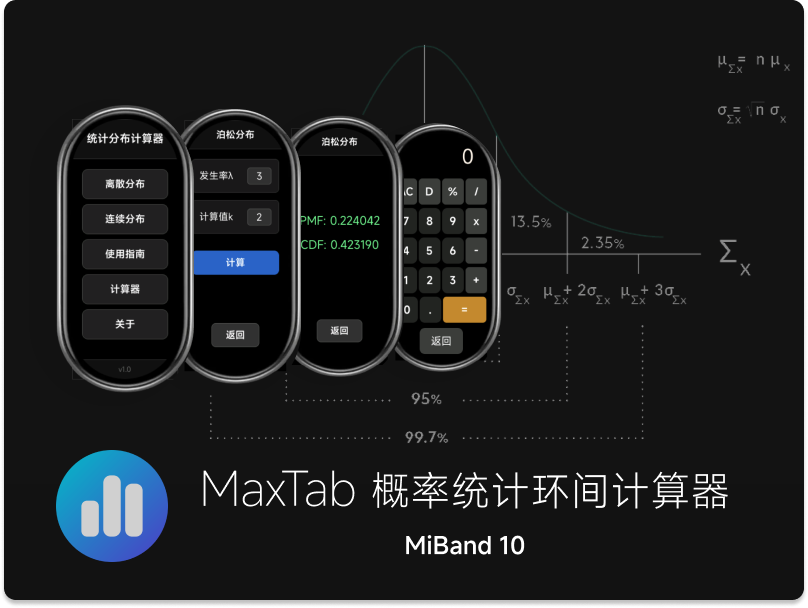

<center>
  
</center>

# 📊 Mi Band 10 统计计算器 | StatsModels

一款针对小米手环 10 开发的专业级统计计算快应用，为用户提供便捷高效的数据分析工具支持。

## ✨ 功能特色

### 🔢 核心统计功能

*   **概率分布计算**：涵盖二项分布、泊松分布、几何分布、负二项分布、超几何分布等离散分布类型
*   **连续分布**：支持正态分布、指数分布、均匀分布、伽马分布、贝塔分布的全参数计算
*   **实时计算**：输入参数后即时返回概率值、分位数值及密度函数值
*   **历史记录**：自动存储计算过程与结果，支持过往分析数据的回溯查看

### 🎯 专为手环优化

*   **圆形界面适配**：完美契合 Mi Band 10 的圆形屏幕显示特性
*   **单手操作设计**：针对小屏设备优化的交互逻辑，提升操作效率
*   **低功耗运行**：通过算法优化实现续航延长，降低能耗
*   **极速启动机制**：毫秒级应用启动速度，减少等待时间


## 📱 安装指南

### 米坛社区安装（推荐）

1.  访问米坛社区 Mi Band 10 专区
2.  搜索 "StatsModels" 或 "统计计算器"
3.  下载`.rpk`格式安装包
4.  通过 Zepp Life 应用完成手环端安装

### 基础使用流程

1.  **启动应用**：在应用列表中选择 "统计计算"
2.  **分布选择**：通过滑动操作选择离散或连续分布类型
3.  **参数输入**：填写对应分布参数（如 $n, p, \lambda$ 等）
4.  **结果查看**：实时显示概率值、数学期望、方差等统计量
5.  **历史保存**：计算结果自动同步至历史记录模块

### 高级功能说明

*   **分位数计算**：输入显著性水平 α 可求解对应分位数 qₐ
*   **概率区间**：支持 $\Pr (a < X < b) = F (b) - F (a)$ 类型区间概率计算
*   **图形显示**：可视化呈现概率密度函数 $f (x)$ 与累积分布函数 $F (x)$
*   **参数估计**：基于样本数据实现分布参数的极大似然估计 $\hat{θ}_{\text{MLE}}$

## 🔧 开发信息

### 项目结构

```
src/

├── pages/                    # 页面文件
│   ├── distributions/        # 各类分布计算页面
│   ├── calculator/           # 通用计算器
│   ├── history/              # 历史记录 （开发中）
│   └── guide/                # 使用指南 （开发中）
├── core/                     # 核心算法 （C语言算法处于开发中）
└── i18n/                     # 语言文件
```

### 本地开发命令

```bash
# 安装依赖
npm install

# 开发模式
npm run start

# 构建发布版本
npm run build
npm run release

# 实时调试
npm run watch
```


## 📊 支持的分布类型
### 离散分布

| 分布类型   | 参数          | 功能                       | 公式                                                         |
| ---------- | ------------- | -------------------------- | ------------------------------------------------------------ |
| 二项分布   | $n$, $p$      | $\Pr(X=k)$, $\Pr(X\leq k)$, 分位数 | $\Pr(X=k) = \binom{n}{k} p^k (1-p)^{n-k}$                      |
| 泊松分布   | $\lambda$     | 概率计算，参数估计         | $\Pr(X=k) = \frac{\lambda^k e^{-\lambda}}{k!}$                 |
| 几何分布   | $p$           | 首次成功概率               | $\Pr(X=k) = p(1-p)^{k-1}$                                      |
| 负二项分布 | $r$, $p$      | 第$r$次成功概率            | $\Pr(X=k) = \binom{k-1}{r-1} p^r (1-p)^{k-r}$                  |
| 超几何分布 | $N$, $K$, $n$ | 有限总体抽样               | $\Pr(X=k) = \frac{\binom{K}{k}\binom{N-K}{n-k}}{\binom{N}{n}}$ |

### 连续分布


| 分布类型 | 参数              | 功能              | 公式                                                         |
| -------- | ----------------- | ----------------- | ------------------------------------------------------------ |
| 正态分布 | $\mu$, $\sigma$   | $Z$分数，区间概率 | $f(x) = \frac{1}{\sqrt{2\pi}\sigma} e^{-\frac{(x-\mu)^2}{2\sigma^2}}$ |
| 指数分布 | $\lambda$         | 等待时间概率      | $f(x) = \lambda e^{-\lambda x},\ x \geq 0$                   |
| 均匀分布 | $a$, $b$          | 区间概率密度      | $f(x) = \frac{1}{b-a},\ a \leq x \leq b$                     |
| 伽马分布 | $\alpha$, $\beta$ | 复合等待时间      | $f(x) = \frac{\beta^\alpha}{\Gamma(\alpha)} x^{\alpha-1} e^{-\beta x}$ |
| 贝塔分布 | $\alpha$, $\beta$ | 比例参数估计      | $f(x) = \frac{x^{\alpha-1}(1-x)^{\beta-1}}{B(\alpha,\beta)},\ 0 \leq x \leq 1$ |

## 🎯 使用场景

### 📈 学习场景

*   **统计学课程**：作为作业计算的辅助工具
*   **考试复习**：快速验证计算结果的正确性
*   **概念理解**：通过可视化功能加深对分布特性的理解

### 💼 工作应用

*   **质量管控**：计算产品缺陷概率及控制限
*   **风险分析**：评估特定事件发生的概率区间
*   **数据科学**：提供基础概率计算支持

### 🎓 研究支持（开发中）

*   **假设检验**：计算 p 值及临界值
*   **置信区间**：均值 μ 的 95% 置信区间 $[\bar{x} - 1.96\frac{\sigma}{\sqrt{n}},\ \bar{x} + 1.96\frac{\sigma}{\sqrt{n}}]$
*   **样本量估算**：实验设计中的样本量计算 $n = (Z_{\alpha/2})^2 \sigma^2 / {E^2}$

## 🔍 常见问题

### Q: 支持哪些小米手环型号？

A: 目前仅支持小米手环10，后续会进行 8/9 的适配

### Q: 计算精度如何？
A: 采用双精度浮点计算引擎，计算精度 $10^{-6}$

### Q: 是否支持离线使用？
A: 完全支持离线运行，无需网络连接

### Q: 如何更新应用？
A: 注意米坛社区，有新版本第一时间进行更新


### 报告问题

*   米坛社区私信：@\[George Huang]
*   GitHub Issues：[提交问题](https://github.com/Goge052215/probcalc-miband/issues)


### 关于作者

George Huang

- GitHub: Goge052215
- 香港大学统计与数据科学学院
