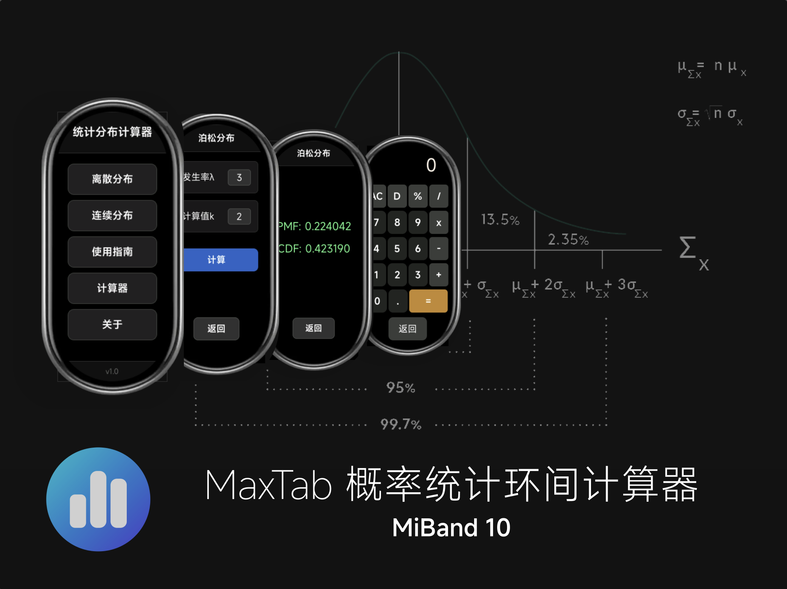

  

# MaxTab | 小米手环 10 概率统计计算器

面向小米手环 10 的概率统计工具，支持手环端离线计算，输入参数即得 PMF/PDF 与 CDF 结果，并提供图形展示与快速操作体验。

## 当前版本

- 正式版：V1.0.3
- V1.1.0：开发中（UI 美化、假设检验、概率模拟即将上线）

## Changelog

- V1.0.1 修复键盘布局不完整问题
- V1.0.2 新增右滑返回
- V1.0.3 内存缓存优化与 Bug 修复，主页面右滑退出

## 主要功能

- 5 种离散分布与 11 种连续分布的计算
- 输入参数即出 PMF/PDF 与 CDF
- 适配跑道屏，支持单手操作
- 键盘适配（感谢 NEORUAA 的 VelaOS 键盘适配）
- 内置简单计算器

## 支持的分布

- 离散：二项、泊松、几何、负二项、超几何
- 连续：正态、指数、均匀、伽马、β、F、t、Pareto、Rayleigh、Weibull、卡方

## 操作指南

1. 选择离散 / 连续分布
2. 输入参数（n、p、λ等）
3. 点击计算查看 PMF/PDF 与 CDF

## 安装说明

1. 访问米坛社区 Mi Band 10 专区
2. 搜索 “MaxTab”
3. 下载 `com.application.watch.demo.release.V1.0.3.rpk`

您也可以通过Astrobox进行下载安装，本项目也在Astrobox上进行了发布。

## 精度与性能

- 计算精度：双精度，约 $10^{-6}$
- 支持离线使用
- V1.0.3 压测峰值约 25MB，日常约 5–7MB

## 适用人群

- 高中与大学统计课程学习者

## 常见问题

### 支持哪些手环型号？

目前支持小米手环 10，后续考虑 9/9 Pro 适配。

### 是否支持离线？

支持，完全离线运行。

## 问题反馈

- 米坛社区私信：@[George Huang]
- GitHub Issues：https://github.com/Goge052215/probcalc-miband/issues

## 关于

George Huang（SAAS, HKU；香港大学统计与精算学系）

**本项目由米坛社区开源项目支持计划提供支持**

