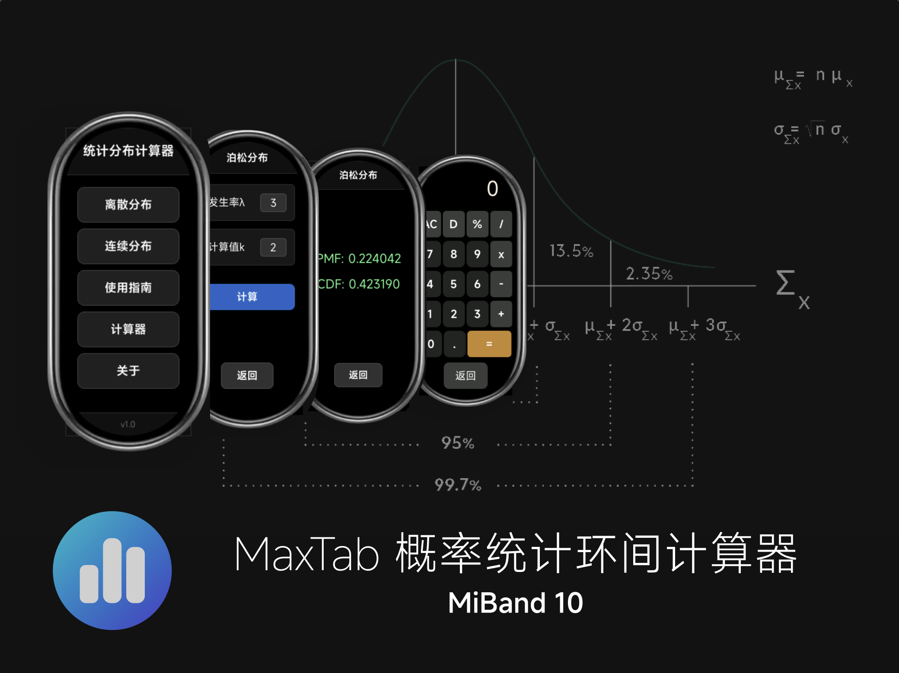

  

# MaxTab | 小米手环 10 概率统计计算器

  
  
  
  
  
  

面向小米手环 10 的概率统计工具，支持手环端离线计算，覆盖常见概率分布、假设检验、线性回归、概率模拟与基础计算功能。输入参数即可得到 PMF/PDF、CDF 与统计结果，并提供适合手环小屏的快捷交互体验。

## 当前版本

- 正式版：V1.1.0
- 上一稳定版本：V1.0.3

## Changelog

- V1.1.0 新增假设检验模块、线性回归结果页、概率模拟、中英双语设置，并完成整体 UI 优化
- V1.0.1 修复键盘布局不完整问题
- V1.0.2 新增右滑返回
- V1.0.3 内存缓存优化与 Bug 修复，主页面右滑退出

## 主要功能

- 5 种离散分布与 11 种连续分布计算
- 输入参数即可得到 PMF/PDF 与 CDF
- 假设检验：Z 检验、t 检验、F 检验、卡方检验
- 线性回归：支持输入 X/Y 数据对并输出回归方程与相关系数
- 概率模拟：抛硬币、扑克牌
- 适配跑道屏，支持单手操作
- 中英双语切换
- 键盘适配（感谢 NEORUAA 的 VelaOS 键盘适配）
- 内置简单计算器
- 内置分布说明、函数说明与使用技巧指南

## 支持的分布

- 离散：二项、泊松、几何、负二项、超几何
- 连续：正态、指数、均匀、伽马、β、F、t、Pareto、Rayleigh、Weibull、卡方

## 支持的统计功能

- 单样本与双样本假设检验流程
- 支持统计量输入与数组输入两种模式
- 线性回归分析与结果展示
- 常见显著性检验结果、P 值与置信区间查看

## 操作指南

1. 在首页选择功能模块：离散分布、连续分布、线性回归、概率模拟、计算器或指南
2. 输入参数（如 n、p、λ、μ、σ，或样本数据）
3. 点击计算查看 PMF/PDF、CDF、检验结果或回归结果
4. 在设置页可切换中英双语显示

## 安装说明

1. 访问米坛社区 Mi Band 10 专区
2. 搜索 “MaxTab”
3. 下载 `com.application.watch.demo.release.V1.1.0.rpk`

您也可以通过 Astrobox 进行下载安装，本项目也已在 Astrobox 上发布。

## 精度与性能

- 计算精度：双精度，约 `10^-6`
- 支持离线使用
- 针对手环小屏与有限内存环境进行了交互与内存管理优化

## 适用人群

- 高中与大学统计课程学习者
- 需要随身查看分布结果与基础统计结论的用户

## 常见问题

### 支持哪些手环型号？

目前支持小米手环 10，后续考虑 9/9 Pro 适配。

### 是否支持离线？

支持，完全离线运行。

### 当前版本新增了什么？

V1.1.0 重点加入了假设检验、线性回归、概率模拟、中英双语设置，以及面向手环界面的整体 UI 优化。

## 问题反馈

- 米坛社区私信：@[George Huang]
- GitHub Issues：[maxtab-source/issues](https://github.com/Goge052215/maxtab-source/issues)

## 关于

George Huang（SAAS, HKU；香港大学统计与精算学系）

**本项目由米坛社区开源项目支持计划提供支持**

